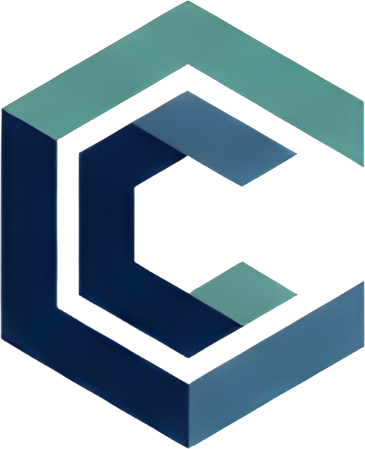

<picture>
  <source media="(prefers-color-scheme: dark)" srcset="./assets/logo-white.png" />
  <source media="(prefers-color-scheme: light)" srcset="./assets/logo-navy.png" />
  
</picture>

 
 

**Sistemas de IA prácticos para pymes**

[Web](https://codarasolutions.com) · [info@codarasolutions.com](mailto:info@codarasolutions.com)

[**Español**](#español) · [**English →**](https://codarasolutions.com/en)

---

## Español

> *Acercamos la IA al negocio real, sin artificios.*

Somos una consultora boutique de IA centrada en pymes. Diseñamos e implementamos sistemas que **automatizan procesos**, **conectan herramientas** y **liberan tiempo** en equipos reales — sin cambiar cómo trabaja tu negocio.

### Sectores con los que trabajamos

| Sector | Resultado típico |
| --- | --- |
| Talleres mecánicos | Menos solicitudes perdidas, más trabajos cerrados. |
| Peluquerías y estética | Menos mensajes, más citas ocupadas. |
| Clínicas y veterinarias | Citas, recordatorios y no-shows bajo control. |
| Autoescuelas | Menos llamadas de precio, más matrículas. |
| Restaurantes | Reservas y confirmaciones gestionadas sin ruido. |
| Agencias de marketing | Menos gestión interna, más trabajo estratégico. |

### Lo que construimos

- **Agentes de voz 24/7** — atienden llamadas, califican leads y extraen datos en tiempo real.
- **Automatización de procesos** — flujos end-to-end sobre el software que ya operas.
- **Integración CRM** — conectamos tus ventas y datos con el stack que ya usas.
- **Chatbots e IA conversacional** — para web, producto y equipos internos.
- **Desarrollo web** — sitios rápidos y modernos con IA integrada.
- **Gestión de servidores y mantenimiento** — infraestructura estable, segura y escalable.

### Cómo trabajamos

1. **Diagnóstico de procesos** — mapeamos personas, procesos y datos antes de proponer.
2. **Diseño de la solución** — priorizamos casos con retorno claro y un plan por fases.
3. **Implementación** — construimos o integramos, medimos y ajustamos en ciclos cortos.
4. **Adopción guiada** — formación, gobernanza y métricas para que la IA genere valor en el tiempo.

### Principios

- **Cercanía** — diseñamos con las personas que van a operar el sistema, no contra ellas.
- **Precisión** — no sobreprometemos. Si algo no funciona, lo decimos antes de firmar.
- **Confianza** — tus datos son tuyos. Documentamos dónde viajan y cómo desactivar cualquier pieza.
- **Resultados** — un proyecto termina cuando hay una métrica concreta mejorando.

### Hablemos

**Diagnóstico gratuito de 30 minutos.** Sin compromiso. Sales con dos o tres ideas aplicables, con o sin nosotros.

→ [codarasolutions.com](https://codarasolutions.com) · [info@codarasolutions.com](mailto:info@codarasolutions.com)

 

  
   
  © Codara Solutions · Madrid, España

